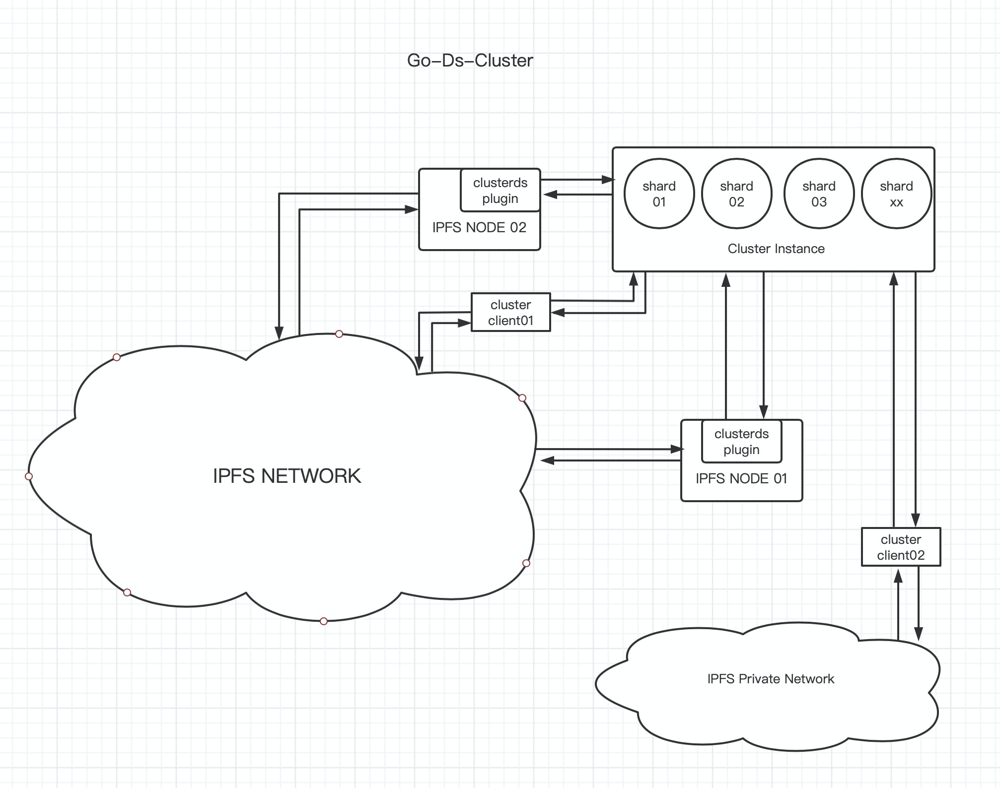

go-ds-cluster
============
> Gathering distributed key-value datastores to become a cluster


<!-- ABOUT THE PROJECT -->
## About The Project

This project is going to implement [go-datastore](https://github.com/ipfs/go-datastore) in a form of cluster.

[IPFS](https://github.com/ipfs/ipfs) is awsome, we like to use ipfs for data sharing. And [IPFS](https://github.com/ipfs/ipfs) using implementation of [go-datastore](https://github.com/ipfs/go-datastore) as base storage.

There are several implementation of [go-datastore](https://github.com/ipfs/go-datastore):
- [go-ds-flatfs](https://github.com/ipfs/go-ds-flatfs)
- [go-ds-badger](https://github.com/ipfs/go-ds-badger)
- [go-ds-leveldb](https://github.com/ipfs/go-ds-leveldb)
- ...

They are mainly focus on storing data within one PC. Single PC has limit on I/O, there lacks a way to take advantage of distributed system with several or more PCs.

We knew [ipfs-cluster](https://github.com/ipfs/ipfs-cluster), it offers a way to manage pin-set within multiple peers. But we thought it is more suitable for manage data backups and recovery. We expect that even only one ipfs peer could also take advantage of distributed storage.

## Architecture

- data node has two basic components
  - datastore offering key-value storage
  - cluster instance maintains cluster related logic
- any node in the cluster can be used has ipfs datastore, sharding data to data-nodes in the cluster
- a key-value table of all data in the datastore has been maintained by every node
- the relation between hash slots and data-node also been maintained by every node
  


## Roadmap

- data sharding and hash slots maintaining 
- communication module based on libp2p between data nodes
- consensus module build up
- hash slots re-allocate and re-balance strategy 
- data migration after hash slots re-allocate or re-balance to support dynamically adding or removing nodes
- authentication and data management


<!-- GETTING STARTED -->
## Getting Started

Instructions about how to run 3 sharding nodes cluster

#### Build binaries
```shell
make dscfg
make dscluster
make dsclient
```

#### Generate config file for bootstrap

```shell

# generate config json files for 3 server nodes cluster
# [srv01-dir] can be arbitrary path you like to keep the cluster config info
./dscfg cluster --cluster-node-number=3 [srv01-dir]
# it will print the p2p address of the bootstrap address, like:
# /ip4/0.0.0.0/tcp/6735/p2p/QmVg7CwtGbRx1ovFE3jktF76jQz1Z3d9hd2yKKHvg1EWKL
# remember to change the 0.0.0.0 to the right ip address of the bootstrapper node if it runs on another pc
ls [srv01-dir]
# config.json 
```
For test case, we can run three nodes on one pc, using tmux will be helpful.

#### Running bootstrapper node
```shell

# using flatfs as datastore
./dscluster --conf=[srv01-dir]
# or using mongods as datastore
# ./dscluster --conf=[srv1cfg-dir] --mongodb="mongodb://localhost:27017" 

# as the we can retrieve cluster config info from bootstapper node
# there is no need to manual copy config to other server nodes config dir

# run node with --bootstrapper and --identity flags
# if there hasn't config.json in config dir, it will retrieve info from bootstrapper node
# then write it to config.json
./dscluster --conf=[srv02-dir] --bootstrapper=/ip4/0.0.0.0/tcp/6735/p2p/QmVg7CwtGbRx1ovFE3jktF76jQz1Z3d9hd2yKKHvg1EWKL --identity=1


./dscluster --conf=[srv03-dir] --bootstrapper=/ip4/0.0.0.0/tcp/6735/p2p/QmVg7CwtGbRx1ovFE3jktF76jQz1Z3d9hd2yKKHvg1EWKL --identity=2

# once the config.json has been generated, we can run node use:
# ./dscluster --conf=[config-dir]
# default value for --conf is ".dscluster"
```
After all three sharding nodes is up, we can use `dsclient` put data into cluster
The `dsclient` also need retrieve cluster info from bootstrapper node at first
```
# use another tmux session
./dsclient --conf=[client-cfg-dir] init --bootstrapper=/ip4/0.0.0.0/tcp/6735/p2p/QmVg7CwtGbRx1ovFE3jktF76jQz1Z3d9hd2yKKHvg1EWKL 
# this cmd will retrieve cluster info and write it to client config file
```
If everything go ok, we can put files into cluster
```
./dsclient --conf=[client-cfg-dir] add /path/to/file
```
Retrieve file from cluster
```
./dsclient --conf=[client-cfg-dir] get [cid] /path/to/save/file
```

#### Embed into ipfs as a plugin

[read about ipfs preloaded-plugins](https://github.com/ipfs/go-ipfs/blob/master/docs/plugins.md#preloaded-plugins)

```shell
# download go-ipfs repo
git clone git@github.com:ipfs/go-ipfs.git
cd go-ipfs

# Add the plugin to the preload list: plugin/loader/preload_list
echo "clusterds github.com/filedrive-team/go-ds-cluster/ipfsplugin *" >> plugin/loader/preload_list
make build
```
Config customed ipfs

```shell
# set ipfs path
export IPFS_PATH=~/.ipfs-dscluster
./ipfs init 
cd ~/.ipfs-dscluster
# modify the "Datasore.Spec" field
vi config
# "Spec": {
#   "mounts": [
#     {
#       "child": {
#         "cfg": "clusterds.json",
#         "type": "clusterds"
#       },
#       "mountpoint": "/blocks",
#       "prefix": "clusterds.datastore",
#       "type": "measure"
#     },
#     {
#       "child": {
#         "compression": "none",
#         "path": "datastore",
#         "type": "levelds"
#       },
#       "mountpoint": "/",
#       "prefix": "leveldb.datastore",
#       "type": "measure"
#     }
#   ],
#   "type": "mount"
# },

# modify the 
echo '{"mounts":[{"cfg":"clusterds.json","mountpoint":"/blocks","type":"clusterds"},{"mountpoint":"/","path":"datastore","type":"levelds"}],"type":"mount"}' > datastore_spec

# generate clusterds.json
/path/to/dscfg client clusterds.json

# finally replace the "nodes" field in clusterds.json
# with really server nodes info 

./ipfs daemon
```


<!-- CONTRIBUTING -->
## Contributing

PRs are welcome!


<!-- LICENSE -->
## License

Distributed under the MIT License. 


<!-- CONTACT -->
## Contact


<!-- ACKNOWLEDGEMENTS -->
## Acknowledgements


